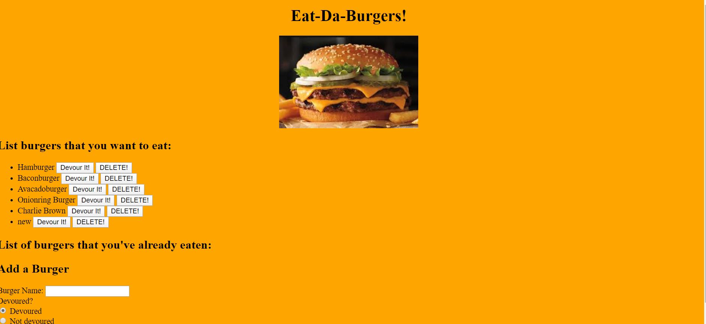

# burger

BURGER RESTAURANT
===============
* This program runs on a local server through node.js

* Eat-Da-Burger! is a restaurant app that lets users input the names of burgers they'd like to eat.

* Whenever a user submits a burger's name, your app will display the burger on the left side of the page -- waiting to be devoured.

* Each burger in the waiting area also has a Devour it! button. When the user clicks it, the burger will move to the right side of the page.

* Each burger in the waiting area also has an "Eat it up" and "Delete" button. When the user clicks the "Eat it up" button it will move to the "Devoured" section of the page.  When they click "Delete" it will be removed completely.

* Your app will store every burger in a database, whether devoured or not.

Dependencies
===============
node  
express  
express-handlebars  
handlebars  
mysql  
npm


## Table of contents
* [General info](#general-info)  
* [User Story](#user-story)  
* [Instructions](#instructions)  
* [Link to Deployed App](#link-to-deployed-app)  
* [GitHub Repo](#github-repo)
* [Screenshots](#screenshots) 

## General Info
* This program runs on a local server through node.js

* Eat-Da-Burger! is a restaurant app that lets users input the names of burgers they'd like to eat.

* Whenever a user submits a burger's name, your app will display the burger on the left side of the page -- waiting to be devoured.

* Each burger in the waiting area also has a Devour it! button. When the user clicks it, the burger will move to the right side of the page.

* Each burger in the waiting area also has an "Eat it up" and "Delete" button. When the user clicks the "Eat it up" button it will move to the "Devoured" section of the page.  When they click "Delete" it will be removed completely.

* Your app will store every burger in a database, whether devoured or not.

## User Story

```
AS A restaurant customer
I WANT to make a list of burgers that I want to eat
SO THAT I can keep track of burgers that I've eaten and not eaten
```

## Link to Deployed App
https://stormy-shelf-07487.herokuapp.com/

## GitHub Repo:
https://github.com/helmsjames/burger

## Screenshots
The following image demonstrates the application functionality:


